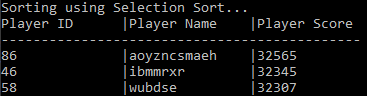

# Player Leaderboard Sort - Console Application
Reads `PlayerList.txt` (created through ['Random Players - File Creator'](https://github.com/Dead245/Random-Players---File-Creator)) and allows user to use 1 of 5 different sorting algorithms to sort it

The five sorting algorithms used are:
- [Selection Sort](https://en.wikipedia.org/wiki/Selection_sort)
- [Bubble Sort](https://en.wikipedia.org/wiki/Bubble_sort)
- [Insertion Sort](https://en.wikipedia.org/wiki/Insertion_sort)
- [Quick Sort](https://en.wikipedia.org/wiki/Quicksort)
- [Merge Sort](https://en.wikipedia.org/wiki/Merge_sort)
> *Links of Sorting Algorithms are to their corresponding Wikipedia entries.*
---
Creates a `unordered_map<int, std::pair<std::string,int>>` called `playerMap` using information from the file.

It does not sort the file itself, or the `playerMap`. Instead, it will create a `vector<int>` of `sortedKeys` that are the sorted order, and then use `playerMap` and `sortedKeys` to print the sorted table into the console.

Once you've chosen a sort method through the menu in the console, it will print the sorted list as a table into the console.

The program will use the `<chrono>` library to time the duration of the sort, and print it out in microseconds after printing the table.

You will have to restart the program to use a different sort method.
